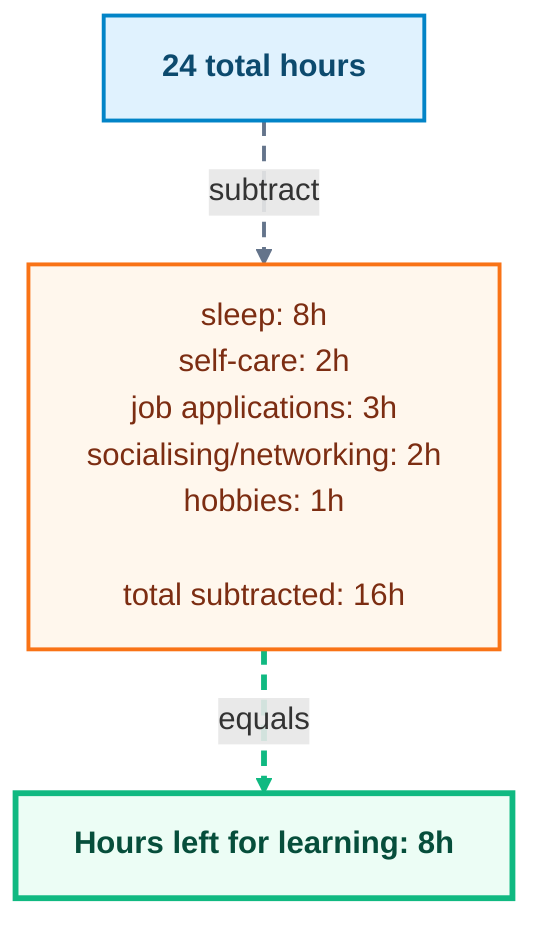
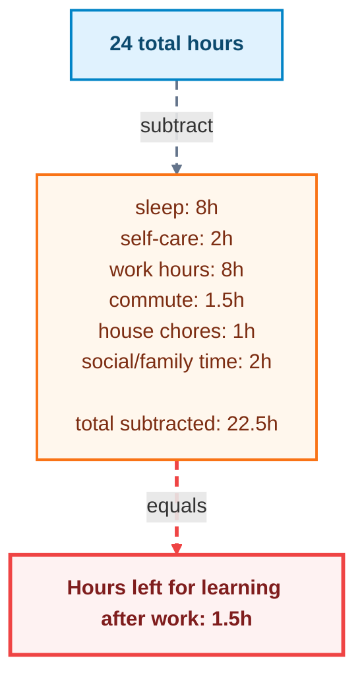

_Photo by [Todd Rhines](https://unsplash.com/@rhinestodd?utm_source=unsplash&utm_medium=referral&utm_content=creditCopyText) on [Unsplash](https://unsplash.com/photos/person-in-black-long-sleeve-shirt-showing-left-hand-W0jzK552m8E?utm_source=unsplash&utm_medium=referral&utm_content=creditCopyText)_

### Motive (or lack of)

Being jobless gives you a new perspective on life. Suddenly you have a lot of time on your hands and you do not know what to do with it. You go to LinkedIn to apply for a job, but you see 1 of 3 things when you go on to that atrocious platform:

- "I am absolutely thrilled to announce that I am embarking on a transformative..."
- "A recruiter noticed you, but you need premium to see them..." (Spoiler alert: they are probably viewing you in private mode, so you cannot even see who viewed your profile)
- "Claude just killed designers..."

All this doom kills your motivation (don't let Claude know this) and you then take a break to hop on to instagram. In your head you are thinking "I know I should learn something new, but I just have no motivation to do so or the strength to do so, however DOOMSCROLLING is definitely easier and more fun". Suddenly, you have doomscrolled for hours, and you feel like crap for being so unproductive, and you are back to square one. You are jobless, procrastinating, and lost. That's like the 3 worst things you can be at once. You could blame the system and the algorithm for pushing you into this abyss, or, you can tell the algorithm to assist you instead.

### Little changes, big effects

I am here to say that there ARE some little things you can do that actively nudges you to learn. If Instagram is your go to doomscrolling platform, you can actively follow and interact with some technology focused content and creators, which will teach your algorithm to push these forward more. Try following **@arjay_the_dev** on Instagram, **@htx_studio** as well as **@gazisj**. For youtube, try **@JomaTech** and **@SebastianLague**. I am not on Tiktok so do not know who are popular there, but I am sure there are relevant people. When you see their content, for example, Arjay's system design reels, HTX Studio's explanations of what inspired them to create a wild new project, or even Joma's hilarious videos, I want you to take a pause and think about what they are saying. Interact with their content, and then try to take an active break and learn more about the topic they are talking about.

Additionally, I would also recommend following some newsletters and online communities that are relevant to your interests. Try [Journal Club](https://journalclub.io/), it is a newsletter that emails you a simple explanation on a new research paper every day (they make it so easy to understand). Also tune into [daily.dev](https://daily.dev), where you are forced to face new technologies and trends in the tech industry every time you open a chrome tab. You can also follow some relevant online communities on even LinkedIn (ew).

### Does being jobless give you more hours to learn?

The best part about being jobless is that you have so much time to learn new things. Job stability is a thing of the past in the tech industry, and if you are an entry/junior/mid-level, then I hate to break it to you, but the dream of the stable job has long gone ever since ChatGPT got released. Learning is the only thing that you can keep doing.

Learning new skills is actually so fun. Did you just **vibe-code** that database migration for your backend? Cool, but have you actually ever thought how a database works underneath? Or how there is a specific library called mermaid that helps you create flowcharts in markdown (like the one above)? Or how your favourite game engine renders graphics? Or how Claude Code works? Imagine how much fun it would be to learn about that. You can use your jobless time to learn about these things and more.

### Conclusion

Look I get it, doomscrolling is something you will do no matter how much you tell yourself you will not anymore. But there are some ways you can make it work for you. You will feel pain, but what you choose to do next is up to you. Will you let it consume you? Or will you use that pain to drive you to strive (+1 rhyme points) for better things? The choice is yours. _But seriously, if you are feeling down, please reach out to someone. You are not alone._

> "Remember, being jobless means you can up-skill and learn new things. Do it for yourself, not for the job market." -- Smart random person on the internet who writes blogs that you should totally listen to.
