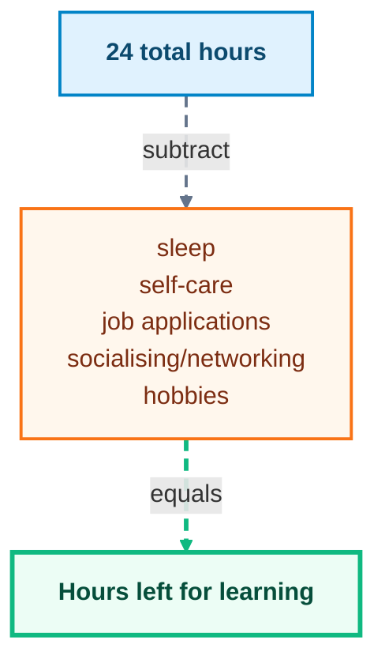

_Photo by [Todd Rhines](https://unsplash.com/@rhinestodd?utm_source=unsplash&utm_medium=referral&utm_content=creditCopyText) on [Unsplash](https://unsplash.com/photos/person-in-black-long-sleeve-shirt-showing-left-hand-W0jzK552m8E?utm_source=unsplash&utm_medium=referral&utm_content=creditCopyText)_

This post is a bit more personal than the others, but I think it is important to share. I have been jobless for a few months and it has been a rollercoaster of emotions.

But like all the other blog posts, I will literally try my best to make this not sappy. The goal of this blog post is not to overcome the depression part, because that requires actual qualifications (cue therapist sponsorship), but rather focus on the limbo stasis where one has ample time to better themselves or pick up on new skills. Who am I to give you this advice? A random person on the internet who writes blogs that you should totally listen to.

### Does being jobless give you more hours to learn?

_(I got no hobbies, so I removed that part for me when I calculated it for myself 😭😭)_

The thing is, this is not all things done in a day. You can choose to spend more time on one skill and less on another. The key is to find a balance that works for you. If you had a job, chances are you would be in that numbless place, doing the same thing every day, and definitely not learning new skills. Learning new skills is actually so fun. Pretty sure you vibe-coded that new database migration for your vibe-coded backend, but hey, have you actually ever thought how a database works? Or how there is a specific library called mermaid that helps you create diagrams in markdown (like the one above)? Or how your favourite game engine works? Or how Claude Code works? Imagine how much fun it would be to learn about that. You can use your jobless time to learn about these things and more.

This is me, beginning my series of learning new things every day. This blog is a soft launch of that, and I will be sharing my learnings and progress in future blog posts. I hope you will join me on this journey of self-improvement and learning new skills.

You will feel pain, but what you choose to do next is up to you. Do you want to use that pain to drive you to strive for better things, or do you want to let it consume you? The choice is yours. _But seriously, if you are feeling down, please reach out to someone. You are not alone._

### Conclusion

There are methods on how to make this learning process easier. I have subscribed to a lot of newsletters that send me interesting articles and resources on a daily basis. Try journalclub, it is a newsletter that sends you a research paper every week. Also tune into daily.dev, where you are forced to face new technologies and trends in the tech industry. You can also join online communities and forums related to your interests. This will help you stay motivated and learn from others who are also learning new skills.

> "Remember, being jobless does not mean you are unemployed. You can still up skill and learn new things. Do it for yourself, not for the job market." -- Smart random person on the internet who writes blogs that you should totally listen to.
