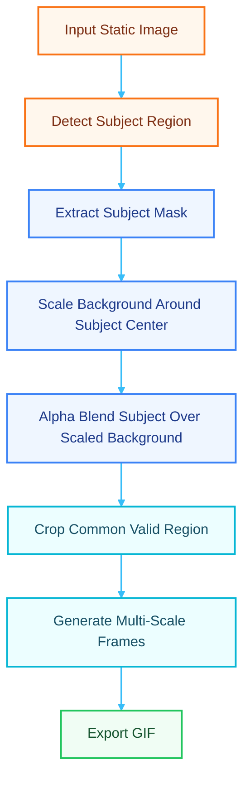

### Motive

Dolly Zoom shots are absolutely majestic and when done right, they add a lot of depth and emotion into the scene in cinematrography. The effect is achieved by moving the camera towards or away from the subject while simultaneously zooming in the opposite direction. This creates a surreal visual where the subject remains the same size while the background appears to stretch or compress.


I wanted to see if I could fake that effect with a **single static image**.

At first that sounds impossible, because no camera is moving. But if you break it down visually, the trick is actually straightforward:

1. Keep the subject fixed in the same position and size.
2. Scale the background in or out around a center point.

I used OpenCV in a notebook for the full pipeline, then generated a sequence of frames and stitched them into a GIF. This was Day 2 of my build-in-public challenge, and it turned into a very fun mix of geometry, masks, and small debugging pain.

### Architecture

I approached this in two phases.

First, I used a toy image with a red rectangle to validate the math and coordinate logic. That helped me verify I could keep the boxed subject in place while shrinking the background.


Because this is a very horrible example, it does not show the vision. But I only need to prove it works with a simple bounding box, and afterwards I can test it on a real photo with an actual person in it.


_Photo by Arth on [Pexels](https://www.pexels.com/photo/man-enjoying-mountainous-landscape-view-30799008/)_

The pipeline is as follows:



### Implementation

The first pass was intentionally simple. I loaded a basic image and isolated a red boundary box using color channel subtraction:

```python
b, g, r = cv2.split(img)
red_signal = cv2.subtract(cv2.subtract(r, g), b)
_, mask = cv2.threshold(red_signal, 50, 255, cv2.THRESH_BINARY)
```

Then I found contours, grabbed the largest red object, and extracted its bounding coordinates. That gave me a reliable ROI to test transformations:

```python
cnts, _ = cv2.findContours(mask, cv2.RETR_EXTERNAL, cv2.CHAIN_APPROX_SIMPLE)
largest_cnt = max(cnts, key=cv2.contourArea)
x, y, w, h = cv2.boundingRect(largest_cnt)
```

I plotted those points with Matplotlib (with axes visible) so I could verify pixel alignment while scaling. This was crucial, because early on I made the classic mistake: scaling happened around the top-left origin instead of the image center.


Correcting that did produce the expected result, where the red box stayed perfectly in place while the white background shrunk around it.

For subject localization, I started with a pre-trained MobileNet-SSD model in OpenCV DNN to get a person box. This only allowed me to do a simple subject identification. However, for a clean subject cutout, I used a pre-trained Mask R-CNN model and extracted the person mask.

- The MobileNet-SSD model info came from [this Kaggle dataset](https://www.kaggle.com/datasets/bouweceunen/pretrained-trt-engines-cocotacohardhatposenet).

- The Mask R-CNN source was [this PyTorch Vision model page](https://docs.pytorch.org/vision/main/models/generated/torchvision.models.detection.maskrcnn_resnet50_fpn.html).


```python
model = torchvision.models.detection.maskrcnn_resnet50_fpn(pretrained=True)
model.eval()

with torch.no_grad():
		prediction = model([img_tensor])
```


After getting the mask, the core composition step was:

1. Compute subject center from mask pixels.
2. Scale the background around that center.
3. Alpha blend the original subject over the scaled background.

```python
M = cv2.getRotationMatrix2D((center_x, center_y), 0, scale)
scaled_bg = cv2.warpAffine(original_cv2, M, (w, h), borderValue=(255, 255, 255))

blended = (foreground * mask_3ch) + (background * (1.0 - mask_3ch))
final_composition = blended.astype(np.uint8)
```


It is important to note that there was a lot of white border around the subject after scaling, which is expected since the background shrinks. To handle that, I computed the transformed corner coordinates and cropped to a common valid region across all frames to keep the animation clean.

Then came the animation part. I generated around 30 scale values from 1.0 to 0.7, repeated the composition process for each scale, and stored each frame.

```python
num_frames = 30
scales = np.linspace(1.0, 0.7, num_frames)
```

Finally, I converted BGR frames to RGB and exported a looping GIF with `imageio`.


### Potential Improvements

For a more polished version, there are several areas to explore:

1. Use a sharper or refined segmentation mask (matting or edge refinement) to reduce weird translucent borders around the subject.
2. Use easing-based interpolation for scale values instead of linear spacing for smoother perceived motion.
3. Add depth-aware background zooming, where closer background elements scale more than distant ones, to enhance the 3D effect. You can read more about it here: [The State of the Art of Depth Estimation from Single Images](https://medium.com/@patriciogv/the-state-of-the-art-of-depth-estimation-from-single-images-9e245d51a315)
4. Turn the notebook into a reusable script/CLI pipeline where input image and frame count are configurable.

Also, Mask R-CNN inference is relatively heavy. For lightweight real-time workflows, a faster segmentation model would make more sense.

### Conclusion

This was a satisfying mini-experiment because it combines a cinematic idea with straightforward CV primitives: detection, masking, affine transforms, and blending. I really like cinemtographic effects, and the fact that I combine this and my love for programming resulted in a good Monday morning.

You can also watch the devlog version of this build for the full step-by-step narrative from rough prototype to final GIF here: [YouTube Video](https://youtu.be/cX-apyqgGrc). The notebook is available on my GitHub repo here: [GitHub Link](https://github.com/MarzukhAsjad/dolly-zoom-on-static-image) or if you want to check the Google collab version, here it is: [Colab Link](https://colab.research.google.com/drive/1n_fnndhpB3-hNfewv_giLyfnigqnq3NT?usp=sharing).

I might improve upon this in the future or explore other cinematic effects, so let me know if you have any suggestions or want to see a specific effect recreated with code!