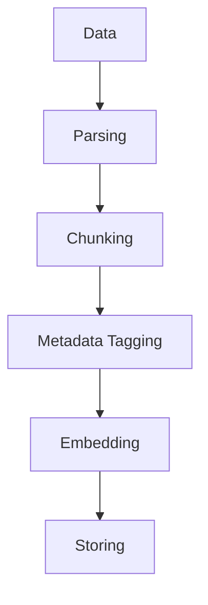
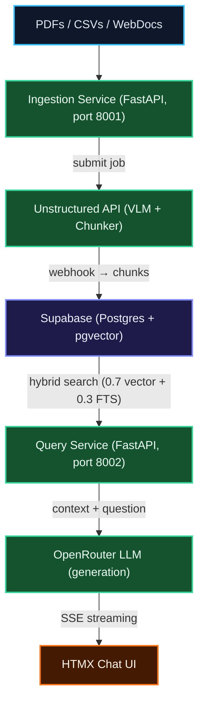

### Motive


I always thought I'd joke about this until I was asked about my passion for ETL (Extract-Transform-Load) by a company I was interviewing at. Like any startup, they also prioritise speed of development, and asked me if I would be able to go more in-depth in the next round about how I would approach ETL into RAG for their industry. So I did what any reasonable engineer would do: I created a fully functional, production-ready, MVP RAG pipeline.

The goal was to create a RAG pipeline that would sustain failures, outages, batch data processing, heavy querying, data protection and productionising it in mind. So instead of opening claude-code and saying "make a RAG pipeline, no mistakes", I researched.

### Findings

For any RAG pipeline, the fundamental depends on the data, and readying it for retrieval. For today's blog, let's take the aesthetics industry as an example. Mostly, the data is in the form of PDFs (clinical reports, treatment guides, product manuals), CSVs (ingredient lists, pricing sheets), and web documents (blog posts, FAQs). There are some exceptions, but this is the general landscape. The core challenge is how to turn this messy unstructured data into something that can be queried efficiently and accurately. The key steps are:



### The Demo: RAG-First, LLM-Second

The core philosophy was simple: **the LLM's job is to summarize retrieved context, not to reason or plan.** This is not an agent — it's a retrieval pipeline with a chat interface slapped on top.

Why not an agent? Because for clinical and regulatory documents, deterministic, citation-backed answers are more valuable than autonomous reasoning. If the context says "Botox should not be used by pregnant women," the LLM must say exactly that — not "it might be inadvisable" because it tried to be clever.



The stack for the demo was deliberately minimal:

| Layer          | Service                         | Why                                                                |
| :------------- | :------------------------------ | :----------------------------------------------------------------- |
| **ETL**        | Unstructured API (job-based)    | VLM partitioner extracts charts/tables, async jobs offload compute |
| **Embeddings** | OpenRouter (Qwen3-Embedding-8B) | #1 on MTEB benchmarks, MRL→1024 dims                               |
| **Generation** | OpenRouter (DeepSeek V4 Flash)  | Dirt cheap, fast, OpenAI-compatible                                |
| **Database**   | Supabase (pgvector + HNSW)      | Single store for vectors, text, metadata                           |
| **Frontend**   | HTMX + vanilla JS               | No React, no build step — just works                               |

The ingestion flow was straightforward: upload a PDF → submit to Unstructured's async job API → webhook fires when done → background poller downloads chunks → OpenRouter extracts metadata and embeds each chunk → upsert to Supabase. The query flow was equally simple: embed the user's question → hybrid search (70% vector similarity + 30% full-text keyword matching) → stuff top-8 chunks into a prompt → stream the answer back via SSE.

```python
# The hybrid search RPC — the secret sauce
ORDER BY
    vector_score * 0.7 + fts_score * 0.3 DESC
```

The 70/30 split is intentional. For aesthetics data, you need semantic understanding ("chronic migraine prevention" should match "migraine prophylaxis"), but you also need exact keyword matching for ingredient names, SKU codes, and percentages.

> "Lead with the specific fact from the context — do not assume or guess. Never contradict what the context says."

That's the system prompt. If the LLM tries to hallucinate, it gets shut down. Every answer comes with inline citations: `[1] report.pdf, p.9`.

---

### The Demo Worked, But...

Within a few days of testing, I hit several pain points:

1. **The webhook was unreliable.** Unstructured's job-completion webhook would randomly not fire. Jobs would sit in "submitted" forever. I ended up adding a direct polling fallback: every 15 seconds, the poller checks Unstructured's API for job status, bypassing the webhook entirely.

2. **FastAPI was overkill for ingestion.** The ingestion service was a Docker container that did one thing: receive a file, forward it to Unstructured, and wait. 95% of its runtime was idle. I was paying for a container that mostly slept.

3. **OpenRouter latency was noticeable from HK.** All requests routed through US endpoints. For a production deployment in Hong Kong, this wasn't going to fly.

4. **The chunking was too small at first.** 512/400/64 looked great on paper but fragmented presentation slides into nonsense. Switching to 2048/1500/160 fixed it — larger context windows, overlapping boundaries, and `chunk_by_title` to preserve section structure.

```json
// The chunking sweet spot after trial and error
{
  "max_characters": 2048,
  "new_after_n_chars": 1500,
  "overlap": 160,
  "multipage_sections": true,
  "overlap_all": true
}
```

![When you realize 512-char chunks were turning your clinical reports into word salad{width: w-75}]

---

### The Production Pitch: FastAPI-Free, Fully Managed

I sat down and asked myself: _"If I were the Head of AI at this company, what would I actually want to run in production?"_ The answer was not "six Docker containers orchestrated by a guy who might leave."

The production architecture I pitched looks like this:


Key changes from the demo:

| Component       | Demo                                      | Production                                                                 |
| :-------------- | :---------------------------------------- | :------------------------------------------------------------------------- |
| **ETL**         | FastAPI + Unstructured Jobs API + webhook | Unstructured **Workflows** (Source → Pipeline → Destination) — zero code   |
| **Embeddings**  | OpenRouter Qwen                           | AWS Bedrock **Cohere Embed English v3** — Singapore region, <50ms to HK    |
| **Generation**  | OpenRouter DeepSeek                       | AWS Bedrock **Claude Haiku** — enterprise SLA, SOC2 compliant              |
| **Query Layer** | FastAPI Docker container                  | **Supabase Edge Function** (Deno) — scales to zero, sits next to data      |
| **Frontend**    | HTMX served by FastAPI                    | **Vercel** (Next.js) — static hosting, zero-ops                            |
| **Metadata**    | OpenRouter LLM per chunk                  | Unstructured **structured_data_extractor** node — managed, schema-enforced |

The beauty of this architecture? **No servers to patch.** Unstructured handles the entire ETL pipeline (partitioning, chunking, enrichment, embedding) and writes directly to your Supabase `unstructured_elements` table via the PostgreSQL destination connector. Supabase Edge Functions handle the query layer. Vercel handles the frontend.

> "The ingestion service, Dockerfiles, and webhook Edge Function — all deleted. ~1,000 lines of Python replaced by a UI configuration."

---

### The Vendor Benchmarking Rabbit Hole

I spent an embarrassing amount of time comparing Unstructured.io with LlamaCloud (LlamaIndex's managed platform). Here's the TL;DR:

#### Full Pipeline Cost Per Page (Parsing → Chunking → Enrichment → Embedding → Store)

| Pipeline Step         | Unstructured (Flat) | LlamaCloud Balanced   | LlamaCloud Performance |
| :-------------------- | :------------------ | :-------------------- | :--------------------- |
| **Parsing**           | Included            | $0.0125 (10 credits)  | $0.05625 (45 credits)  |
| **Chunking**          | Included            | $0.005 (4 credits)    | $0.005 (4 credits)     |
| **Enrichment**        | Included            | $0.01875 (15 credits) | $0.01875 (15 credits)  |
| **Embedding**         | Included            | $0.0025 (2 credits)   | $0.0025 (2 credits)    |
| **Store to pgvector** | Included            | Included              | Included               |
| **TOTAL / page**      | **$0.03**           | **$0.03875**          | **$0.0825**            |

Unstructured's flat $0.03/page includes **any VLM model** — even Claude 3.7 Sonnet, whose raw Bedrock inference alone costs ~$0.0315/page. They're effectively subsidizing the model at scale. LlamaCloud unbundles every step and charges per complexity tier.

For aesthetics documents (which need Agentic-tier parsing for charts and tables), **Unstructured is both cheaper and simpler.**

I also benchmarked the models available for each pipeline node (all via AWS Bedrock, Singapore region):

#### VLM Partitioning (the "does it actually read the chart?" test)

| Tier           | Model             | Layout Quality                                           |
| :------------- | :---------------- | :------------------------------------------------------- |
| 🥇 Performance | Claude 3.7 Sonnet | Elite — unmatched spatial reasoning for clinical charts  |
| 🥈 Balanced    | Amazon Nova Pro   | High — handles multi-column layouts, embedded images     |
| 🥉 Budget      | Amazon Nova Lite  | Medium — fine for text-heavy docs, struggles with charts |

#### Embedding (the "does the RAG actually find the right chunk?" test)

| Tier           | Model                           | Retrieval Quality                                        |
| :------------- | :------------------------------ | :------------------------------------------------------- |
| 🥇 Performance | Voyage-3-Large (1536d)          | #1 MTEB — requires separate VoyageAI key                 |
| 🥈 Balanced    | Cohere Embed English v3 (1024d) | Compression-aware training excels at ingredient names    |
| 🥉 Budget      | Titan Embeddings v2 (1024d)     | Fine for general text, weaker on specialized terminology |

The recommended stack: **Nova Pro (partitioning) + Cohere English v3 (embedding) + Claude Haiku (enrichment)**. All Bedrock-native, all in Singapore. Estimated OpEx: **$100–300/month** for the entire pipeline.

## ![When your vendor comparison spreadsheet has more rows than your actual codebase{width: w-75}]

### The Metadata Pipeline: Why Tagging Matters

Raw text retrieval is dumb. If a user asks "What are the side effects of Botox?" and your database has 10,000 chunks from 50 different documents, pure vector search might return chunks about Botox pricing or Botox history — not side effects.

The solution: **structured metadata extraction at ingestion time.**

The Unstructured workflow includes a `structured_data_extractor` node that tags every document with:

```json
{
  "doc_type": "treatment_guide",
  "category": "clinical_data",
  "brand": "Botox",
  "language": "en",
  "region": ["CA"],
  "tags": ["botox", "chronic_migraine", "injection_therapy"]
}
```

But here's the catch: Unstructured's `elements_with_extracted_data` mode attaches this metadata only to the **document header element**, not to every chunk. So I added a Supabase trigger that propagates metadata to all chunks sharing the same `record_id`:

```sql
CREATE OR REPLACE FUNCTION propagate_unstructured_metadata()
RETURNS TRIGGER AS $$
BEGIN
    IF NEW.type = 'DocumentData' AND NEW.extracted_data IS NOT NULL THEN
        UPDATE unstructured_elements
        SET extracted_data = NEW.extracted_data
        WHERE record_id = NEW.record_id AND type != 'DocumentData';
    END IF;
    RETURN NEW;
END;
$$ LANGUAGE plpgsql;
```

Now every chunk is independently filterable: "Show me side effects for **brand=Botox** in **region=CA**." That's not possible with raw vector search alone.

---

### The Supabase Table Design

Unstructured's PostgreSQL destination connector expects specific column names. Here's the table I landed on after reading their docs:

```sql
CREATE TABLE unstructured_elements (
    id              UUID PRIMARY KEY DEFAULT gen_random_uuid(),
    element_id      TEXT NOT NULL,          -- Unstructured's element identifier
    record_id       TEXT NOT NULL,          -- Groups chunks from the same document
    text            TEXT NOT NULL,          -- Chunked text content
    embeddings      VECTOR(1024),           -- Cohere Embed English v3 = 1024 dims
    type            TEXT,                   -- DocumentData, CompositeElement, etc.
    filename        TEXT,                   -- Source filename
    page_number     TEXT,                   -- Page metadata
    filetype        TEXT,                   -- application/pdf, etc.
    languages       TEXT[],                 -- ['eng', 'chi_tra']
    extracted_data  JSONB,                  -- Auto-tagged: doc_type, brand, region, tags
    text_as_html    TEXT,                   -- VLM output: preserves table structure
    full_metadata   JSONB,                  -- Catch-all for anything not mapped above
    created_at      TIMESTAMPTZ DEFAULT now()
);
```

And the hybrid search RPC:

```sql
CREATE OR REPLACE FUNCTION match_unstructured_elements(
    query_embedding VECTOR(1024),
    query_text      TEXT DEFAULT NULL,
    match_count     INT  DEFAULT 8
)
RETURNS TABLE (
    id UUID, text TEXT, filename TEXT, page_number TEXT,
    extracted_data JSONB, vector_score FLOAT8, fts_score FLOAT8
)
LANGUAGE plpgsql AS $$
BEGIN
    RETURN QUERY
    SELECT e.id, e.text, e.filename, e.page_number, e.extracted_data,
        (1 - (e.embeddings <=> query_embedding))::FLOAT8 AS vector_score,
        COALESCE(ts_rank(to_tsvector('english', e.text),
            plainto_tsquery('english', query_text))::FLOAT8, 0) AS fts_score
    FROM unstructured_elements e
    ORDER BY vector_score * 0.7 + fts_score * 0.3 DESC
    LIMIT match_count;
END;
$$;
```

One `SELECT match_unstructured_elements(...)` and you get the top-8 most relevant chunks, scored and ranked. No external search engine needed.

---

### The Webhook Debacle (And How I Fixed It)

Midway through testing, the pipeline just... stopped. Files uploaded fine, Unstructured processed them, but the downstream steps (metadata extraction, embedding, Supabase upsert) never happened.

Turns out, Unstructured's webhook notification channel had been silently deactivated. The webhook was registered, visible in the UI, but not firing. Zero logs in Supabase. Jobs sat at `submitted` indefinitely.

> "When your webhook is supposed to fire but chooses violence instead."

My fix: **stop relying on the webhook entirely.**

The ingestion poller now does both:

```python
async def poll_completed_jobs():
    while True:
        # Path 1: webhook-driven (already completed)
        webhook_jobs = sb.table("unstructured_jobs").select("*")\
            .eq("status", "completed").limit(5).execute()

        # Path 2: poll Unstructured directly for submitted jobs
        submitted_jobs = sb.table("unstructured_jobs").select("*")\
            .eq("status", "submitted").limit(10).execute()

        for job in submitted_jobs.data:
            us_status = get_job_status(job["job_id"])  # One API call
            if us_status == "COMPLETED":
                # Transition to completed → process downstream
                sb.table("unstructured_jobs").update({
                    "status": "completed"
                }).eq("job_id", job["job_id"]).execute()

        # Process all completed jobs: download → extract → embed → upsert
        ...
```

The `get_job_status()` function is literally one line:

```python
def get_job_status(job_id: str) -> str:
    return client.jobs.get_job(request={"job_id": job_id})\
        .job_information.status
```

The webhook still exists as a fast path — if it fires, great, the job gets processed immediately. If it doesn't, the 15-second poller catches it. Belt and suspenders.

---

### The Frontend: HTMX, Because I'm Not a React Developer

The chat UI is a single `index.html` file with zero build steps. HTMX handles the interactivity, SSE handles the streaming, and vanilla JS handles the sidebar document management.

```html
<!-- The entire chat input -->
<form hx-post="/chat" hx-target="#chat-messages" hx-swap="beforeend">
  <input type="text" name="query" placeholder="Ask a question..." />
  <button type="submit">Send</button>
</form>
```

The streaming response arrives as SSE events:

```javascript
data: {"type":"citations","data":[{"index":1,"doc":"Botox.pdf","page":3}]}
data: {"type":"token","data":"Based"}
data: {"type":"token","data":" on"}
data: {"type":"token","data":" the"}
data: {"type":"token","data":" context"}
data: {"type":"done"}
```

The sidebar shows real-time status for each uploaded document: "Parsing & chunking..." → "Downloading results..." → "Extracting metadata + embedding..." → "Done — 12 chunks". The polling hits the job status endpoint every few seconds and updates the DOM.

![The UI in its full HTMX glory — no React, no npm install, no 47 vulnerabilities{width: w-100}]

---

### Evaluation: How Do You Know It's Not Hallucinating?

You can't just vibe-check a RAG pipeline. I designed a two-layer evaluation framework:

**Layer 1 — Retrieval Quality (txtai/BEIR-adapted)**: Benchmarks the search engine itself. NDCG@10, MAP@10, Recall@10, Precision@10 against a custom aesthetics Q&A dataset. Runs whenever chunking or embedding configs change.

**Layer 2 — Full RAG Quality (DeepEval + RAGAS)**: Tests the complete pipeline. Faithfulness (are answers grounded in context?), Context Recall (were the right chunks retrieved?), Answer Relevance (does the answer actually address the question?). Runs in CI/CD — fails the build if metrics drop below thresholds.

```python
# test_rag.py — fails the PR if quality drops
def test_faithfulness():
    for item in GROUND_TRUTH:
        answer, chunks = run_rag_query(item["question"])
        test_case = LLMTestCase(
            input=item["question"],
            actual_output=answer,
            retrieval_context=chunks,
        )
        assert_test(test_case, [FaithfulnessMetric(threshold=0.85)])
```

The industry standard in 2026: **DeepEval for CI/CD gating + RAGAS for the metric math + Arize Phoenix (OSS) for observability.** All three are framework-agnostic — they work with raw Supabase queries, no LangChain required.

---

### Future Improvements (Or: What I'd Do With More Time)

**1. Self-host Unstructured for data control.** The managed SaaS is great for getting started, but if DKL's data is sensitive enough to require full data residency, Unstructured offers in-VPC deployment. The pipeline itself doesn't change — just the endpoint URL.

**2. Agentic capabilities for complex queries.** Pure RAG can't answer "Which products contain Chemical X AND Chemical Y?" because that requires two searches and a set intersection. An agent could decompose the query into multiple RAG calls, compute the intersection of results, and synthesize a cited answer. The RAG becomes a tool the agent calls, not the entire system.

**3. Product entity table for relational queries.** Right now, "Find all products containing Hyaluronic Acid under $50" is impossible because there's no price data in the vector store. A separate Postgres table with product entities (name, ingredients, price, SKU) joined with `document_chunks` would enable filtered retrieval with SQL JOINs.

**4. Cohere Rerank for cross-lingual retrieval.** When documents in English and Traditional Chinese coexist in the same embedding space, semantic drift happens. A cross-encoder reranker (Cohere Rerank or FlashRank) applied after initial retrieval can boost precision for mixed-language queries.

**5. Real-time ingestion via CDC.** The current pipeline is batch-oriented (upload → process → store). For near-real-time updates, Postgres logical replication + an event-driven architecture would stream changes directly into the ingestion pipeline.

---

### Source Code

The full pipeline is open source. You can find it in the [DKL repository](https://github.com/MarzukhAsjad/career-ops/tree/main/DKL/aesthetic-rag-demo) along with the production pitch, evaluation guide, and interview Q&A document. The architecture is designed to be made yours — swap the embedding model, change the chunking strategy, or migrate the ETL to LlamaCloud if that better fits your stack.

![The repo when someone actually reads the README{width: w-50}]

---

### Conclusion

Building a RAG pipeline isn't just about getting it to work — it's about knowing **when to build and when to buy.** The demo took a weekend. The productionisation took another week of benchmarking, vendor comparison, and architectural refinement. But the result is a pipeline that costs less than a team lunch and runs itself.

If you're building something similar, here's my advice: **offload everything you can.** Unstructured for ETL, Supabase for storage, Bedrock for inference. Focus your engineering time on what differentiates your product — the retrieval quality, the metadata schema, the evaluation pipeline — not on managing infrastructure.

And if your webhook stops working, just poll the API. It's less elegant, but it actually works.

---

_Got questions about the architecture or want to fork the project? The [repo](https://github.com/MarzukhAsjad/career-ops) is public. PRs welcome._
