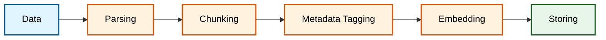
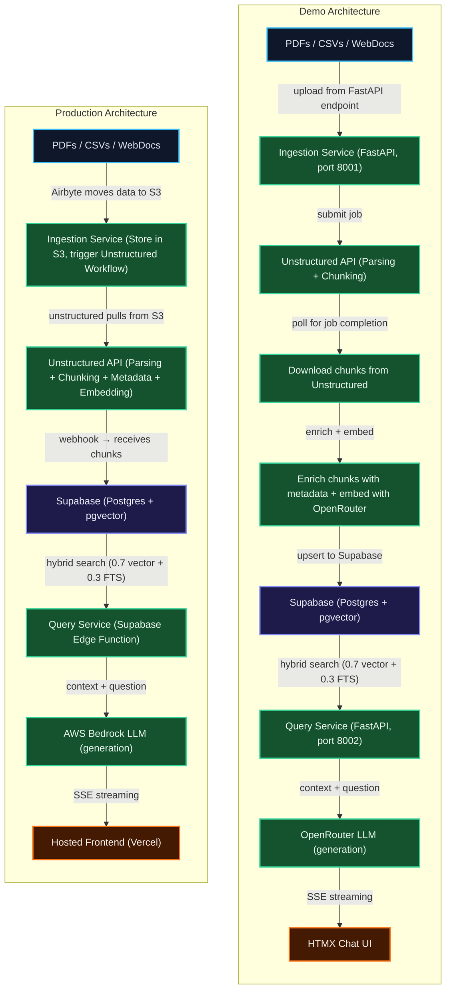

### Motive


I always thought I'd joke about this until I was asked about my passion for ETL (Extract-Transform-Load) by a company I was interviewing at. Like any startup, they also prioritise speed of development, and asked me if I would be able to go more in-depth in the next round about how I would approach ETL into RAG for their industry. So I did what any reasonable engineer would do: I created a fully functional, production-ready, MVP RAG pipeline.

The goal was to create a RAG pipeline that would sustain failures, outages, batch data processing, heavy querying, data protection and productionising it in mind. So instead of opening claude-code and saying "make a RAG pipeline, no mistakes", I researched.

### Findings

##### Storing

For any RAG pipeline, the foundation depends on the data, and readying it for retrieval. For today's blog, let's take the aesthetics industry as an example. Mostly, the data is in the form of PDFs (clinical reports, treatment guides, product manuals), CSVs (ingredient lists, pricing sheets), and web documents (blog posts, FAQs). There are some exceptions, but this is the general landscape. The core challenge is how to turn this messy unstructured data into something that can be queried efficiently and accurately. The key steps are:



First, documents are parsed to extract content while preserving structure and context. The parsed content is then chunked into manageable segments optimized for retrieval. Metadata tagging enriches each chunk with semantic information and document context. Finally, the chunks are embedded into vector representations and stored in a searchable database, enabling fast and relevant similarity-based retrieval when users query the system.

When I saw the documents, with their complicated layouts, embedded tables, and domain-specific language, I knew that a simple text extraction wouldn't cut it. I needed a solution that could understand the structure of the documents, identify key sections, and extract meaningful metadata. [Unstructured.io](https://unstructured.io/)'s VLM (Vision-Language Model) capabilities stood out as a perfect fit for this task. Not because it spammed the VLM for all pages in a document, but it smartly routed text heavy pages into their text parsing service, where as, embedded text in images/tables/complicated layouts were routed to their VLM, all done, automatically. FYI, [Llamaindex](https://www.llamaindex.ai/) also is a good alternative, both offering open-source self-hostable solutions. I'll get into more details regarding their comparison in the later part of the blog.


This is the production workflow I ended up with on Unstructured's UI. The source is a PDF, stored in supabase (ideally, an S3 bucket or a GDrive folder in production). The workflow is triggered whenever a new file is added to the source. Unstructured pulls the file and the VLM partitioner automatically routes pages of the file to the appropriate parsing method (text extraction for simple pages, VLM for complex layouts). The structured data extractor enriches the chunks with metadata tags (like doc_type, brand, region). Finally, the PostgreSQL destination connector writes the chunks directly into my Supabase database, ready for retrieval.

##### Retrieval

That leaves the querying part. The embedding involves turning the chunks into vector representations that capture their semantic meaning. This allows us to perform similarity searches when a user queries the system. Now I need a proper vector database, a search algorithm, and an embedding model that can map my query into the same vector space as my stored chunks. I also need to consider how to generate a human-readable answer from the retrieved chunks, which involves using a language model to synthesize the information. For these tasks, I choose:

- **Vector Database**: [Supabase](https://supabase.com/) with pgvector extension.
- **Embedding Model**: [Cohere Embed English v3](https://cohere.com/embed) for its compression-aware training and strong performance on specialized terminology.
- **Language Model**: [AWS Bedrock Claude Haiku](https://aws.amazon.com/bedrock/models/claude-haiku/) for its enterprise-grade performance and SOC2 compliance.

The above is the production stack, but for the demo, I used OpenRouter's Qwen3-Embedding-8B and DeepSeek V4 Flash for embedding and generation respectively, due to their cost-effectiveness and OpenAI compatibility. Also because the workflow I showed in the **`Storing`** section depends on data being available in bulk in the database, which is not the case for the demo.


### The Demo: RAG-First, LLM-Second

The core philosophy was simple: **the LLM's job is to summarize retrieved context, not to reason or plan.** This is not an agent — it's a retrieval pipeline with a chat interface slapped on top.

Why not an agent? Well, duh because I only had 3 days? But also the RAG will serve as the base layer, which can later be converted into a tool for an Agent to be used. The RAG is the foundation, the Agent is the fancy interface on top. If I had more time, I would have added an Agent layer that could decompose complex queries into multiple RAG calls, compute intersections of results, and synthesize answers. But for this demo, I wanted to focus on getting the RAG pipeline right first.

### The Architecture

Okay so I have been discussing both the production architecture and the demo architecture, and the contents are all over the place. So let's get them straight:



Notice that the production architecture is fully managed and serverless. The right graph is the demo architecture, which uses FastAPI for ingestion and querying, and OpenRouter for embedding and generation. The core difference is that the production architecture offloads everything it can to managed services (Unstructured Workflows, Supabase Edge Functions, AWS Bedrock), while the demo architecture has more custom code and infrastructure to glue things together. The demo is meant to be a proof of concept that the pipeline works end-to-end, while the production architecture is meant to be a scalable, maintainable solution that can run in a real-world environment.

```python
# The hybrid search for the demo, implemented as a SQL function in Supabase
ORDER BY
    vector_score * 0.7 + fts_score * 0.3 DESC
```

The 70/30 split is intentional. For aesthetics data, you need semantic understanding ("chronic migraine prevention" should match "migraine prophylaxis"), but you also need exact keyword matching for ingredient names, SKU codes, and percentages.

### What is the industry standard search algorithm for RAG pipelines?

Industry standards however point to better algorithms such as [BM25](https://www.geeksforgeeks.org/nlp/what-is-bm25-best-matching-25-algorithm/), Cross-Encoders, and Rerankers. BM25 is a strong baseline for keyword-based retrieval, especially when combined with vector search. Cross-Encoders can provide more accurate relevance scoring by jointly encoding the query and document, but they are computationally expensive (At this point, I'd handover this step to a more ML guy). Rerankers like Cohere Rerank or FlashRank can be applied after an initial retrieval step to boost precision, especially in mixed-language scenarios. The choice of algorithm depends on the specific requirements of the application, such as latency constraints, the importance of recall vs precision, and the nature of the documents being retrieved. My hybrid approach (70% vector similarity + 30% FTS) is a pragmatic compromise that leverages the strengths of both semantic and keyword search. FYI, `FTS` means **Full Text Search**, which is a built-in feature of PostgreSQL that allows for efficient searching of text data.

> "Lead with the specific fact from the context, do not assume or guess. Never contradict what the context says."

That's the system prompt. If the LLM tries to hallucinate, it gets shut down. Every answer comes with inline citations: `[1] report.pdf, p.9`.

### The Demo Worked, But...

Within a day of testing, I hit several pain points:

2. **FastAPI was overkill for ingestion.** The ingestion service was a Docker container that did one thing: receive a file, forward it to Unstructured, and wait. 95% of its runtime was idle. I was paying for a container that mostly slept.

3. **OpenRouter latency was noticeable from HK.** All requests routed through US endpoints. For a production deployment in Hong Kong, this wasn't going to fly.

4. **The chunking was too small at first.** 512/400/64 looked great on paper but fragmented presentation slides into nonsense.

```json
{
  "max_characters": 2048,
  "new_after_n_chars": 1500,
  "overlap": 160,
  "multipage_sections": true,
  "overlap_all": true
}
```

The above is the final chunking config I ended up with on Unstructured after quite some trial and error. Good thing is, Unstructured itself offers lots of options for chunking such as `chunk_by_title`, `chunk_by_heading`, `chunk_by_page`, `chunk_by_image`, etc. which can be used in combination with the character-based chunking to preserve the structure of the document and avoid breaking up important sections. 512-char chunks were turning important clinical reports into **word salad**.


### The Vendor Benchmarking Rabbit Hole

I spent an embarrassing amount of time comparing Unstructured.io with LlamaCloud (LlamaIndex's managed platform). Here's the TL;DR:

#### Full Pipeline Cost Per Page (Parsing → Chunking → Enrichment → Embedding → Store)

| Pipeline Step         | Unstructured (Flat) | LlamaCloud Balanced   | LlamaCloud Performance |
| :-------------------- | :------------------ | :-------------------- | :--------------------- |
| **Parsing**           | Included            | $0.0125 (10 credits)  | $0.05625 (45 credits)  |
| **Chunking**          | Included            | $0.005 (4 credits)    | $0.005 (4 credits)     |
| **Enrichment**        | Included            | $0.00625 (5 credits)  | $0.01875 (15 credits)  |
| **Embedding**         | Included            | $0.00125 (1 credit)   | $0.0025 (2 credits)    |
| **Store to pgvector** | Included            | Included              | Included               |
| **TOTAL / page**      | **$0.03**           | **$0.025**            | **$0.0825**            |

Pricing on Llamaindex.ai is derived from here: [LlamaIndex Pricing 2026: Plans, Costs & ROI](https://checkthat.ai/brands/llamaindex/pricing). 

Unstructured's flat $0.03/page includes **any VLM model** — even Claude 3.7 Sonnet, whose raw Bedrock inference alone costs ~$0.0315/page. They're effectively subsidizing the model at scale. LlamaCloud unbundles every step and charges per complexity tier.

For aesthetics documents (which need Agentic-tier parsing for charts and tables), **Unstructured is both cheaper and simpler.**

I also benchmarked the models available for each pipeline node (all via AWS Bedrock):

#### VLM Partitioning (the "does it actually read the chart?" test)

| Tier           | Model             | Layout Quality                                           |
| :------------- | :---------------- | :------------------------------------------------------- |
| 🥇 Performance | Claude 3.7 Sonnet | Elite — unmatched spatial reasoning for clinical charts  |
| 🥈 Balanced    | Amazon Nova Pro   | High — handles multi-column layouts, embedded images     |
| 🥉 Budget      | Amazon Nova Lite  | Medium — fine for text-heavy docs, struggles with charts |

#### Embedding (the "does the RAG actually find the right chunk?" test)

| Tier           | Model                           | Retrieval Quality                                        |
| :------------- | :------------------------------ | :------------------------------------------------------- |
| 🥇 Performance | Voyage-3-Large (1536d)          | #1 MTEB — requires separate VoyageAI key                 |
| 🥈 Balanced    | Cohere Embed English v3 (1024d) | Compression-aware training excels at ingredient names    |
| 🥉 Budget      | Titan Embeddings v2 (1024d)     | Fine for general text, weaker on specialized terminology |

The recommended stack: **Nova Pro (partitioning) + Cohere English v3 (embedding) + Claude Haiku (enrichment)**. All Bedrock-native, can be deployed in Hong Kong (please double check on whether HK supports deploying this). Estimated OpEx: **$100–300/month** for the entire pipeline.

### The Frontend: HTMX, Because it's light, fast, and requires zero build steps


The chat UI is a single `index.html` file with zero build steps. HTMX handles the interactivity, SSE handles the streaming, and vanilla JS handles the sidebar document management.

```html
<!-- The entire chat input -->
<form hx-post="/chat" hx-target="#chat-messages" hx-swap="beforeend">
  <input type="text" name="query" placeholder="Ask a question..." />
  <button type="submit">Send</button>
</form>
```

The streaming response arrives as SSE events:

```javascript
data: {"type":"citations","data":[{"index":1,"doc":"Botox.pdf","page":3}]}
data: {"type":"token","data":"Based"}
data: {"type":"token","data":" on"}
data: {"type":"token","data":" the"}
data: {"type":"token","data":" context"}
data: {"type":"done"}
```

The sidebar shows real-time status for each uploaded document: "Parsing & chunking..." → "Downloading results..." → "Extracting metadata + embedding..." → "Done — 12 chunks". The polling hits the job status endpoint every few seconds and updates the DOM.

### Evaluation: How Do You Know It's Not Hallucinating?

You can't just vibe-check a RAG pipeline. For the production architecture, you should design a two-layer evaluation framework:

**Layer 1 — Retrieval Quality (txtai/BEIR-adapted)**: Benchmarks the search engine itself. NDCG@10, MAP@10, Recall@10, Precision@10 against a custom aesthetics Q&A dataset. Runs whenever chunking or embedding configs change.

**Layer 2 — Full RAG Quality (DeepEval + RAGAS)**: Tests the complete pipeline. Faithfulness (are answers grounded in context?), Context Recall (were the right chunks retrieved?), Answer Relevance (does the answer actually address the question?). Runs in CI/CD — fails the build if metrics drop below thresholds.

```python
# test_rag.py — fails the PR if quality drops
def test_faithfulness():
    for item in GROUND_TRUTH:
        answer, chunks = run_rag_query(item["question"])
        test_case = LLMTestCase(
            input=item["question"],
            actual_output=answer,
            retrieval_context=chunks,
        )
        assert_test(test_case, [FaithfulnessMetric(threshold=0.85)])
```

The industry standard in 2026: **DeepEval for CI/CD gating + RAGAS for the metric math + Arize Phoenix (OSS) for observability.** All three are framework-agnostic — they work with raw Supabase queries, no LangChain required.

### Future Improvements (Or: What I'd Do With More Time)

**1. Self-host Unstructured for data control.** The managed SaaS is great for getting started, but if your data is sensitive enough to require full data residency, Unstructured offers in-VPC deployment (for more large scale), or even self-hosting their open-source solution (straight up pain to maintain, but possible). This would eliminate the need for a separate S3 bucket and reduce latency by keeping everything in the same cloud environment. You'd have to set up your own infrastructure for parsing, chunking, and embedding, but it would give you full control over the data and potentially lower costs at scale.

**2. Agentic capabilities for complex queries.** Pure RAG can't answer "Which products contain Chemical X AND Chemical Y?" because that requires two searches and a set intersection. An agent could decompose the query into multiple RAG calls, compute the intersection of results, and synthesize a cited answer. The RAG becomes a tool the agent calls, not the entire system.

**3. Product entity table for relational queries.** Right now, "Find all products containing Hyaluronic Acid under $50" is impossible because there's no price data in the vector store. A separate Postgres table with product entities (name, ingredients, price, SKU) joined with `document_chunks` would enable filtered retrieval with SQL JOINs.

**4. Cohere Rerank for cross-lingual retrieval.** When documents in English and Chinese coexist in the same embedding space, semantic drift happens. A cross-encoder reranker (Cohere Rerank or FlashRank) applied after initial retrieval can boost precision for mixed-language queries.

### Source Code

The full pipeline is open source. You can find it in the [demo-rag-repo](https://github.com/MarzukhAsjad/aesthetic-rag-demo). The architecture is designed to be made yours — swap the embedding model, change the chunking strategy, or migrate the ETL to LlamaCloud if that better fits your stack. Read the README for setup instructions, and feel free to fork and modify as needed.


### Conclusion

Building a RAG pipeline isn't just about getting it to work — it's about knowing **when to build and when to buy.** The demo took a weekend. The productionisation will take another week of benchmarking, vendor comparison, and architectural refinement. But the result is a pipeline that costs less than a team lunch and runs itself (don't forget to include my salary though). Sorry I got no youtube video for this one and also for consuming 3 days of the build-in-public series, but I'll try for the next one.

_Got questions about the architecture or want to fork the project? Feel free to fork the repo or open up any discussion there_
